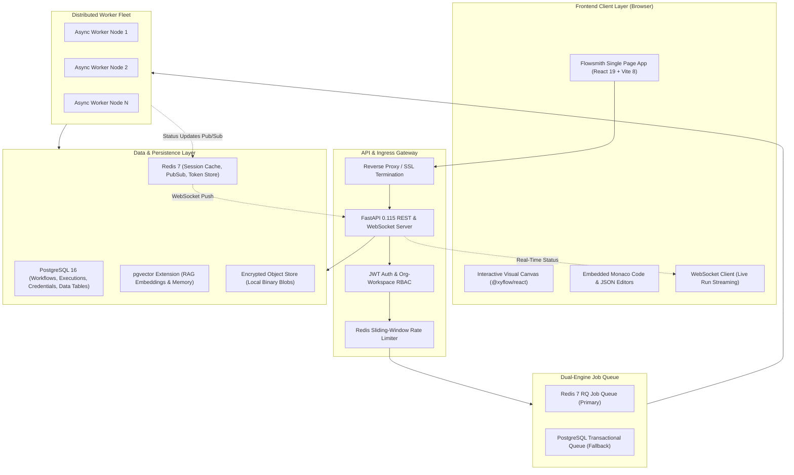
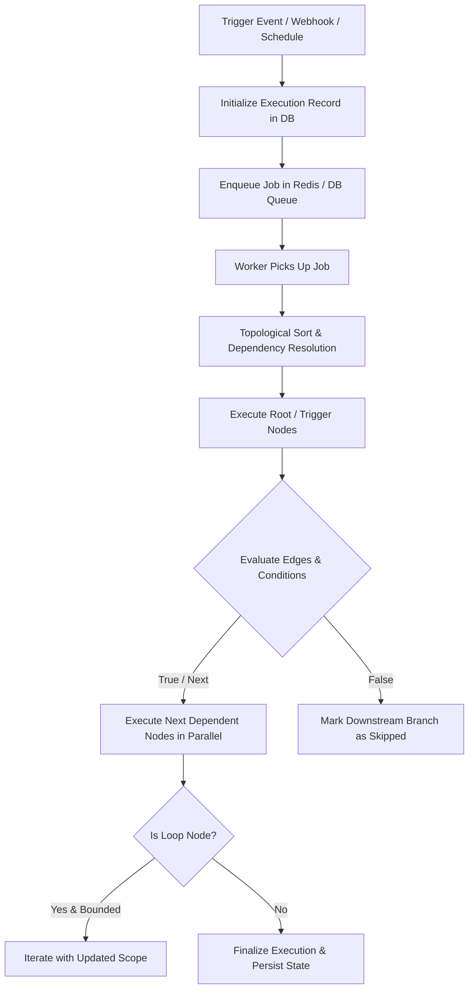

# Flowsmith — System Architecture Specification

> **System Version**: 2.5.0  
> **Core Architecture**: Sovereign Distributed DAG Orchestration Engine  
> **Backend**: FastAPI 0.115 / Python 3.12 / PostgreSQL 16 (pgvector) / Redis 7  
> **Frontend**: React 19 / Vite 8 / React Flow 12 / Zustand / Monaco Editor  

---

## 1. High-Level System Architecture

Flowsmith is architected as an event-driven, decoupled automation platform consisting of an interactive SPA client, an asynchronous ASGI API gateway, a distributed worker pool, and a dual-engine transactional queue.



---

## 2. Frontend Architecture & State Management

### 2.1 Technology Stack
* **UI Framework**: React 19 with functional components and modern hooks (`useTransition`, `useDeferredValue`).
* **Build System**: Vite 8 with Rollup code-splitting, producing aggressive chunk separation:
  * `vendor-react` (React, ReactDOM, React Router)
  * `vendor-flow` (`@xyflow/react`)
  * `vendor-monaco` (Monaco Code Editor runtime)
  * On-demand lazy-loaded node editors (`SalesforceNodeEditor`, `DynamicsCrmNodeEditor`, `CodeNodeEditor`, etc.).
* **Styling**: Vanilla CSS tokens through the **Obsidian Glass** design system (`forms.css`, `node-editor-modal.css`).

### 2.2 Client State Store Architecture (Zustand)
Flowsmith uses focused, decoupled Zustand stores to manage canvas, execution, and UI state without unnecessary re-renders:

```
┌─────────────────────────────────────────────────────────────┐
│                     ZUSTAND STORE FLEET                     │
├──────────────────────┬──────────────────────────────────────┤
│ 1. workflowStore.js  │ Nodes, edges, history (undo/redo),   │
│                      │ dirty tracking, auto-layout engine   │
├──────────────────────┼──────────────────────────────────────┤
│ 2. executionStore.js │ Active execution ID, live step logs, │
│                      │ execution metrics, output inspector  │
├──────────────────────┼──────────────────────────────────────┤
│ 3. uiStore.js        │ Modal states, active drawer tabs,    │
│                      │ theme overrides, canvas zoom/pan     │
└──────────────────────┴──────────────────────────────────────┘
```

---

## 3. Backend Architecture & API Gateway

### 3.1 Framework & Concurrency Model
* **Framework**: FastAPI 0.115 on Python 3.12, running under `uvicorn` with `uvloop` high-performance event loop.
* **Asynchronous Execution**: Fully non-blocking I/O for network HTTP connectors, database queries (`asyncpg`), and Redis operations (`redis-py` async client).
* **CPU Sandboxing**: Sandboxed Python and JavaScript code nodes execute in isolated child processes with memory caps, strict execution timeouts (default: 30s), and disabled access to system file/network primitives.

### 3.2 Modular Router Layout
The backend separates concerns into dedicated domain routers in `backend/app/api/`:
* `auth.py`: User registration, login, JWT issuance, password reset, and organization membership.
* `workflows.py`: Workflow CRUD, versioning, duplicate/clone, import/export, active state toggle.
* `executions.py`: Manual run trigger, execution trace retrieval, live run cancellation.
* `credentials.py`: Encrypted vault storage, type validation, 1-click OAuth connect/refresh endpoints.
* `nodes.py`: Node catalog discovery, parameter schema validation, single-step test execution.
* `connectors.py`: First-party connector metadata, live schema inspection (Salesforce/Dynamics discovery).
* `data_tables.py`: Relational table schema builder, row queries, bulk CSV/JSON import.
* `ai.py` & `rag.py`: Multi-provider chat completion, prompt evaluation, vector collection management.
* `ws.py`: High-frequency WebSocket endpoint for broadcasting live node status and output payloads.

---

## 4. DAG Traversal & Execution Engine



### 4.1 Dependency Traversal & Parallelism
1. **Topological Sort**: The workflow JSON definition (nodes and edges) is parsed into an adjacency list. In-degree calculation identifies root trigger nodes.
2. **Parallel Node Dispatch**: Nodes whose upstream dependencies have successfully resolved are executed concurrently via `asyncio.gather()`, dramatically reducing total run duration for branching workflows.
3. **Condition Branching**: Nodes like `if_condition` and `switch` dynamically evaluate upstream data payloads using JEXL expressions. Unmatched branch paths are immediately tagged as `skipped` without throwing errors.
4. **Controlled Loop Mechanism**: The dedicated `loop_while` node permits iterative loops within strict bounds (maximum iterations default: 1,000, max execution time: 300s), preventing infinite cycle deadlocks.
5. **Sub-Workflow Recursion Guard**: Sub-workflows are traced with a parent execution chain header. If execution depth exceeds 5 nested calls, a `RecursionDepthExceededError` halts execution safely.

---

## 5. Dual-Engine Queue & Worker Reliability

Flowsmith implements a resilient dual-queue architecture designed to survive infrastructure degradation:

| Component | Redis Queue (Primary) | PostgreSQL DB Queue (Fallback) |
| :--- | :--- | :--- |
| **Mechanism** | Redis 7 Lists (`BRPOPLPUSH`) | Postgres `SELECT FOR UPDATE SKIP LOCKED` |
| **Throughput** | 10,000+ operations/sec | 1,500 operations/sec |
| **Persistence** | In-memory with Redis AOF / RDB | Strict ACID durability in PostgreSQL |
| **Failure Mode** | Auto-switches to DB Queue if Redis goes down | Primary operational database |

### 5.1 Worker Heartbeat & Orphan Recovery
* Every active worker sends a periodic heartbeat timestamp to the database (`worker_heartbeats`).
* If a worker node crashes or is killed by OOM, the **Orphan Sweeper** identifies jobs left in `running` status without an active heartbeat for > 60 seconds.
* Abandoned jobs are automatically reclaimed, safely rescheduled, or marked as `failed` with diagnostic crash metadata.

---

## 6. Persistence & Storage Architecture

```
┌─────────────────────────────────────────────────────────────┐
│                    POSTGRESQL 16 CLUSTER                    │
├──────────────────────────────┬──────────────────────────────┤
│ Core Relational Tables       │ High-Scale Vector Store      │
│  - users & organizations     │  - vector_collections        │
│  - workflow_records          │  - vector_embeddings (1536d) │
│  - executions & step_logs    │  - HNSW Index for cosine sim │
│  - credential_vault (AES)    │                              │
│  - custom_data_tables & rows │                              │
└──────────────────────────────┴──────────────────────────────┘
```

1. **PostgreSQL 16**: Primary data store utilizing JSONB columns for flexible workflow graph storage and indexed relational keys for audit and search.
2. **pgvector Extension**: Powers semantic search and episodic agent memory. Stores 1536-dimensional OpenAI or 768-dimensional Ollama embeddings with hierarchical navigable small-world (HNSW) index for sub-10ms vector searches.
3. **Encrypted Object Store (`local_store.py`)**: Stores large binary blobs (PDF attachments, CSV dumps, images) on the local disk using tenant-isolated directory paths, encrypted at rest with Fernet.

---

## 7. Security Architecture & Boundary Isolation

### 7.1 Zero-Trust SSRF Defense (`safe_http_client.py`)
All HTTP requests originating from user workflows or webhooks pass through a strict socket-level SSRF validator:
* **Private IP Blocking**: Prohibits resolution to RFC 1918 subnets (`10.0.0.0/8`, `172.16.0.0/12`, `192.168.0.0/16`).
* **Loopback & Link-Local Guard**: Rejects `127.0.0.0/8` and cloud metadata services (`169.254.169.254`).
* **DNS Rebinding Protection**: Resolves IP addresses before socket connection and pins the socket to the validated IP.

### 7.2 Vault Encryption
* All credential secrets (`client_secret`, `api_key`, `refresh_token`, `password`) are encrypted at rest using AES-256-GCM.
* Cryptographic keys are derived from the root environment variable `CREDENTIALS_ENCRYPTION_KEY` using PBKDF2 with 100,000 iterations.
* Secret values are never returned over the REST API and are redacted from logs and execution traces.

---

## 8. AI-Native Workflow Orchestration Architecture

Flowsmith is designed around the core principle:

> **AI PROPOSES. FLOWSMITH VALIDATES. THE EXECUTION ENGINE EXECUTES.**

```
        USER INTENT
             ↓
       AI UNDERSTANDING (IntentEngine)
             ↓
       WORKFLOW PLANNING (WorkflowIR)
             ↓
    CAPABILITY DISCOVERY (CapabilityRegistry & Search)
             ↓
       WORKFLOW IR
             ↓
    DETERMINISTIC COMPILER (WorkflowCompiler)
             ↓
      STATIC VALIDATION (PipelineValidator: 6 Stages)
             ↓
      SECURITY VALIDATION (SSRF & Secret Scrubbing)
             ↓
        SIMULATION (WorkflowSimulator: Mock Topological Execution)
             ↓
       AI AUTO-REPAIR (WorkflowRepairer: Diff Generation)
             ↓
        USER APPROVAL
             ↓
       CREATE WORKFLOW (Visual Canvas DAG)
             ↓
        TEST / EXECUTE (Worker Fleet)
             ↓
      OBSERVE / DEBUG (Step Logs & Metrics)
             ↓
       OPTIMIZE / REPAIR (Cost, Latency, Reliability)
```

### 8.1 Workflow Intermediate Representation (IR)
The intermediate representation (`WorkflowIR`) abstracts high-level business intent away from UI layout coordinates and low-level internal node names:
- **`IRTrigger`**: Webhook, Schedule (Cron/Interval), Event, Polling, Manual.
- **`IRStep`**: Normalized actions, conditions, loops, parallel branches, AI agents, HTTP calls, connectors, approvals.
- **`IRConnection`**: Directed dependency links with typed handle binding (`main`, `true`, `false`, `approved`).
- **`IRErrorPolicy`**: Retry budgets, exponential backoff, timeout caps, and failure alert channels.

### 8.2 Deterministic Compiler
The `WorkflowCompiler` translates `WorkflowIR` into an executable Flowsmith DAG:
- Matches systems against live `NODE_REGISTRY` and `ConnectorRegistry`.
- Maps parameters and expressions (`{{ $json.field }}`).
- Positions nodes on visual grid layout with horizontal spacing.
- Enforces strict DAG validation rules.

### 8.3 6-Stage Validation Pipeline (`PipelineValidator`)
Before any generated workflow is presented to the user or saved to disk, it must pass 6 validation stages:
1. **Structural Validation**: Connected DAG, valid handles, no disconnected nodes, Kahn's algorithm cycle detection.
2. **Connector Schema Validation**: Operation existence, required parameters, type checks.
3. **Data & Expression Validation**: Syntax checking of double-curly expressions (`{{ $json.field }}`), pipe validity, and dunder-call protection.
4. **Credential Health Validation**: Checks for active credentials matching required connector and LLM auth.
5. **Runtime Policy Validation**: Concurrency bounds, timeouts, retry limits ($\le 5$).
6. **Security Validation**: Secret scrubbing (detecting hardcoded API tokens or private keys) and SSRF protection.

### 8.4 Non-Destructive Workflow Simulator (`WorkflowSimulator`)
Simulates execution without performing external state mutations:
- Topologically traverses nodes.
- Injects synthetic test payloads and propagates mock responses downstream.
- Estimates step-by-step latency and verifies expression bindings.

### 8.5 Auto-Repair & NL Modification (`WorkflowRepairer` & `WorkflowModifier`)
- **Diagnostic Engine**: Analyzes execution trace and failure payloads (e.g. HTTP 429 rate limit or schema mismatch).
- **Safe Proposal Diff**: Generates targeted before/after diffs (e.g. adding exponential backoff retries, inserting human approval gates, or migrating AI models) for explicit human review.

