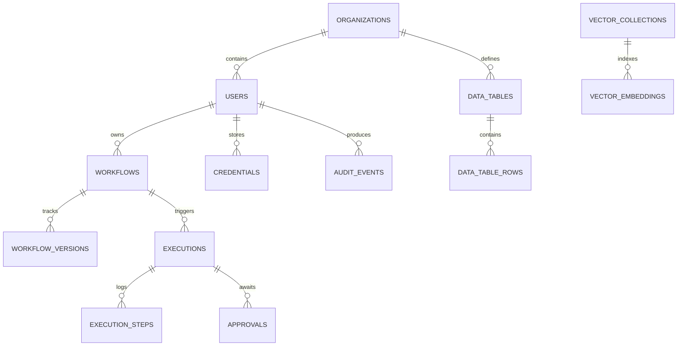

# Flowsmith — Database Architecture & Schema Guide

> **Primary Engine**: PostgreSQL 16  
> **Vector Extension**: `pgvector` (1536-dimensional HNSW Index)  
> **ORM & Driver**: SQLAlchemy 2.0 / `asyncpg` / `psycopg2`  
> **Migration Engine**: Alembic  

---

## 1. Database Overview & Technology Stack

Flowsmith relies on **PostgreSQL 16** as its single, sovereign persistence engine. By pairing PostgreSQL’s transactional ACID durability with JSONB document capabilities and the `pgvector` extension, Flowsmith eliminates the need for separate document stores, search clusters, or dedicated vector databases.



---

## 2. Core Entity Schemas

### 2.1 Identity & Access (`users`, `organizations`)
```sql
CREATE TABLE users (
    id SERIAL PRIMARY KEY,
    email VARCHAR(255) NOT NULL UNIQUE,
    hashed_password VARCHAR(255) NOT NULL,
    full_name VARCHAR(120),
    role VARCHAR(32) NOT NULL DEFAULT 'editor', -- admin, editor, viewer
    is_active BOOLEAN NOT NULL DEFAULT TRUE,
    created_at TIMESTAMP WITH TIME ZONE DEFAULT CURRENT_TIMESTAMP,
    updated_at TIMESTAMP WITH TIME ZONE DEFAULT CURRENT_TIMESTAMP
);

CREATE TABLE organizations (
    id VARCHAR(36) PRIMARY KEY, -- UUIDv4
    name VARCHAR(120) NOT NULL,
    slug VARCHAR(64) NOT NULL UNIQUE,
    branding_config JSONB DEFAULT '{}',
    created_at TIMESTAMP WITH TIME ZONE DEFAULT CURRENT_TIMESTAMP
);
```

### 2.2 Workflows & Versions (`workflows`, `workflow_versions`)
```sql
CREATE TABLE workflows (
    id VARCHAR(36) PRIMARY KEY, -- e.g. "wf_7f8a1b2c"
    user_id INT NOT NULL REFERENCES users(id) ON DELETE CASCADE,
    organization_id VARCHAR(36) REFERENCES organizations(id) ON DELETE CASCADE,
    name VARCHAR(120) NOT NULL,
    description TEXT,
    data JSONB NOT NULL DEFAULT '{"nodes": [], "edges": []}',
    active BOOLEAN NOT NULL DEFAULT FALSE,
    version INT NOT NULL DEFAULT 1,
    webhook_path VARCHAR(120) UNIQUE,
    cron_expression VARCHAR(64),
    created_at TIMESTAMP WITH TIME ZONE DEFAULT CURRENT_TIMESTAMP,
    updated_at TIMESTAMP WITH TIME ZONE DEFAULT CURRENT_TIMESTAMP
);

CREATE TABLE workflow_versions (
    id SERIAL PRIMARY KEY,
    workflow_id VARCHAR(36) NOT NULL REFERENCES workflows(id) ON DELETE CASCADE,
    version INT NOT NULL,
    data JSONB NOT NULL,
    created_by INT REFERENCES users(id),
    created_at TIMESTAMP WITH TIME ZONE DEFAULT CURRENT_TIMESTAMP,
    UNIQUE(workflow_id, version)
);
```

### 2.3 Executions & Step Logs (`executions`, `execution_steps`)
```sql
CREATE TABLE executions (
    id VARCHAR(36) PRIMARY KEY, -- e.g. "exec_9a8b7c6d"
    workflow_id VARCHAR(36) NOT NULL REFERENCES workflows(id) ON DELETE CASCADE,
    user_id INT NOT NULL REFERENCES users(id),
    workflow_version INT NOT NULL,
    trigger_type VARCHAR(32) NOT NULL, -- manual, webhook, schedule, api
    status VARCHAR(32) NOT NULL DEFAULT 'queued', -- queued, running, success, failed, cancelled
    input_payload JSONB DEFAULT '{}',
    output_payload JSONB DEFAULT '{}',
    error_details JSONB,
    duration_ms FLOAT,
    started_at TIMESTAMP WITH TIME ZONE,
    finished_at TIMESTAMP WITH TIME ZONE,
    created_at TIMESTAMP WITH TIME ZONE DEFAULT CURRENT_TIMESTAMP
);

CREATE TABLE execution_steps (
    id BIGSERIAL PRIMARY KEY,
    execution_id VARCHAR(36) NOT NULL REFERENCES executions(id) ON DELETE CASCADE,
    node_id VARCHAR(64) NOT NULL,
    node_type VARCHAR(64) NOT NULL,
    status VARCHAR(32) NOT NULL, -- running, success, error, skipped
    input_data JSONB,
    output_data JSONB,
    error_message TEXT,
    duration_ms FLOAT,
    executed_at TIMESTAMP WITH TIME ZONE DEFAULT CURRENT_TIMESTAMP
);
```

### 2.4 Encrypted Credential Vault (`credentials`)
```sql
CREATE TABLE credentials (
    id VARCHAR(36) PRIMARY KEY,
    user_id INT NOT NULL REFERENCES users(id) ON DELETE CASCADE,
    organization_id VARCHAR(36) REFERENCES organizations(id),
    type VARCHAR(64) NOT NULL, -- salesforce, dynamics_crm, google, postgres, etc.
    name VARCHAR(120) NOT NULL,
    encrypted_data TEXT NOT NULL, -- AES-256-GCM ciphertext + IV + tag
    metadata JSONB DEFAULT '{}',  -- Non-sensitive metadata (e.g. scopes, org_url)
    created_at TIMESTAMP WITH TIME ZONE DEFAULT CURRENT_TIMESTAMP,
    updated_at TIMESTAMP WITH TIME ZONE DEFAULT CURRENT_TIMESTAMP
);
```

### 2.5 Native Relational Data Tables (`data_tables`, `data_table_rows`)
```sql
CREATE TABLE data_tables (
    id VARCHAR(36) PRIMARY KEY,
    organization_id VARCHAR(36) REFERENCES organizations(id) ON DELETE CASCADE,
    name VARCHAR(120) NOT NULL,
    description TEXT,
    schema_definition JSONB NOT NULL, -- Column names, types, constraints
    row_count INT NOT NULL DEFAULT 0,
    created_at TIMESTAMP WITH TIME ZONE DEFAULT CURRENT_TIMESTAMP
);

CREATE TABLE data_table_rows (
    id BIGSERIAL PRIMARY KEY,
    table_id VARCHAR(36) NOT NULL REFERENCES data_tables(id) ON DELETE CASCADE,
    data JSONB NOT NULL, -- Row values stored as structured JSONB
    created_at TIMESTAMP WITH TIME ZONE DEFAULT CURRENT_TIMESTAMP,
    updated_at TIMESTAMP WITH TIME ZONE DEFAULT CURRENT_TIMESTAMP
);
```

### 2.6 Vector Store & RAG Embeddings (`vector_embeddings`)
```sql
CREATE EXTENSION IF NOT EXISTS vector;

CREATE TABLE vector_collections (
    id VARCHAR(36) PRIMARY KEY,
    name VARCHAR(120) NOT NULL UNIQUE,
    dimension INT NOT NULL DEFAULT 1536,
    metadata JSONB DEFAULT '{}'
);

CREATE TABLE vector_embeddings (
    id BIGSERIAL PRIMARY KEY,
    collection_id VARCHAR(36) NOT NULL REFERENCES vector_collections(id) ON DELETE CASCADE,
    document_id VARCHAR(120) NOT NULL,
    chunk_index INT NOT NULL DEFAULT 0,
    content TEXT NOT NULL,
    embedding vector(1536) NOT NULL,
    metadata JSONB DEFAULT '{}',
    created_at TIMESTAMP WITH TIME ZONE DEFAULT CURRENT_TIMESTAMP
);
```

---

## 3. Indexing & Query Optimization

Flowsmith enforces specific indexing strategies to ensure sub-50ms query times at enterprise scale:

1. **Composite B-Tree Indexes on Executions**:
   ```sql
   CREATE INDEX idx_exec_wf_status ON executions (workflow_id, status, created_at DESC);
   CREATE INDEX idx_exec_user ON executions (user_id, created_at DESC);
   ```
2. **GIN Indexes on JSONB Graph Data & Data Tables**:
   ```sql
   CREATE INDEX idx_workflows_data_gin ON workflows USING GIN (data);
   CREATE INDEX idx_data_table_rows_data_gin ON data_table_rows USING GIN (data);
   ```
3. **HNSW Vector Index for High-Speed Semantic Search**:
   ```sql
   CREATE INDEX idx_vector_embeddings_hnsw ON vector_embeddings
   USING hnsw (embedding vector_cosine_ops)
   WITH (m = 16, ef_construction = 64);
   ```

---

## 4. Database Migrations (Alembic)

Database schema evolution is strictly tracked via Alembic:
* Migration scripts reside in `backend/alembic/versions/`.
* **Applying Migrations**:
  ```bash
  alembic upgrade head
  ```
* **Generating a New Migration**:
  ```bash
  alembic revision --autogenerate -m "add dynamics_crm credentials support"
  ```
* **Rollback**:
  ```bash
  alembic downgrade -1
  ```

---

## 5. Retention Pruning & Maintenance (`prune()`)

High-volume workflow execution generates millions of execution steps and webhook delivery records. Flowsmith includes an automated maintenance module (`backend/app/maintenance.py`):
* **Pruning Logic**:
  * Deletes finished executions (`success`, `failed`, `cancelled`) older than `RETENTION_DAYS` (default: 30 days).
  * Automatically cascades deletions to associated `execution_steps` and `webhook_deliveries`.
  * Preserves `running` and `queued` executions regardless of age.
* **Scheduled Trigger**: Invoked automatically by the background maintenance daemon or via admin REST call `POST /api/admin/maintenance/prune`.
