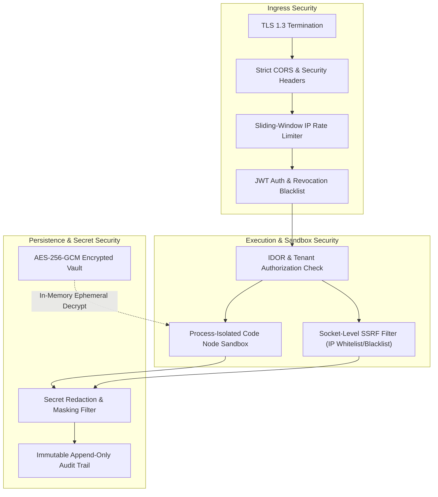

# Flowsmith — Enterprise Security & Compliance Guide

> **Security Classification**: Enterprise Tier-1 Hardened  
> **Key Encryption**: AES-256-GCM / Fernet (PBKDF2 SHA-256)  
> **Egress Filtering**: Zero-Trust Kernel/Socket SSRF Defense  
> **Compliance Alignment**: SOC 2 Type II, ISO 27001, GDPR, HIPAA Ready  

---

## 1. Security Philosophy & Threat Model

Flowsmith is engineered to operate in high-security, regulated enterprise environments where data sovereignty is paramount. The platform enforces a **Zero-Trust Egress and Storage Architecture**:
1. **Never Trust Network Egress**: User-defined webhooks, HTTP nodes, and AI agents are assumed to be potentially hostile or misconfigured. All outbound network traffic is scrutinized at the socket level.
2. **Never Store Secrets in Plaintext**: All credentials, tokens, passwords, and private keys are encrypted at rest with authenticated encryption.
3. **Never Leak Secrets to Clients**: Decrypted secrets exist only in ephemeral process memory during node execution and are strictly redacted from API responses and execution logs.
4. **Enforce Tenant Isolation at the Query Layer**: Every database query is strictly partitioned by `organization_id` and `user_id`.



---

## 2. Encrypted Credential Vault (`credentials_engine.py`)

Flowsmith maintains an isolated, encrypted credential vault for managing API keys, OAuth tokens, and database passwords:

### 2.1 Cryptographic Primitives
* **Primary Algorithm**: **AES-256-GCM** (Authenticated Encryption with Associated Data).
* **Key Derivation**: Root key derived from the master secret (`CREDENTIALS_ENCRYPTION_KEY`) using **PBKDF2** with **100,000 rounds** of HMAC-SHA256.
* **Nonce / IV**: Unique cryptographically secure 96-bit Initialization Vector (IV) generated per encryption operation via `os.urandom(12)`.
* **Tamper Detection**: 128-bit authentication tag appended to ciphertext. Any bit modification results in immediate decryption failure.
* **Legacy Backward Compatibility**: Built-in support for decrypting legacy Fernet tokens (AES-128-CBC + HMAC-SHA256) with automatic upgrade to AES-256-GCM upon save.

### 2.2 In-Memory Lifecycle & Secret Redaction
* Credentials remain encrypted in PostgreSQL until the exact instant a node handler requires them.
* Decrypted values exist strictly in the scope of the executing Python async task and are garbage-collected immediately upon completion.
* **API Redaction**: All API endpoints (`GET /api/credentials`, `GET /api/workflows`) pass payloads through a recursive redaction filter (`SECRET_FIELDS = {"client_secret", "password", "api_key", "token", "refresh_token"}`) that masks secret keys as `••••••••••••`.

---

## 3. Zero-Trust SSRF Defense (`safe_http_client.py`)

Server-Side Request Forgery (SSRF) represents the greatest threat in workflow automation engines that permit outbound HTTP calls. Flowsmith implements multi-layered socket protection:

### 3.1 Prohibited IP Address Ranges
Any attempt to connect to the following subnets is rejected with an immediate `SSRFBlockedError`:
* **IPv4 Private Subnets (RFC 1918)**:
  * `10.0.0.0/8`
  * `172.16.0.0/12`
  * `192.168.0.0/16`
* **Loopback Interfaces**:
  * `127.0.0.0/8` (`localhost`, `127.0.0.1`, etc.)
* **Link-Local & Cloud Metadata Endpoints**:
  * `169.254.0.0/16` (Blocks AWS, GCP, Azure metadata services: `http://169.254.169.254/latest/meta-data/`)
* **IPv6 Equivalents**:
  * `::1` (Loopback)
  * `fc00::/7` (Unique Local)
  * `fe80::/10` (Link-Local)

### 3.2 DNS Rebinding Mitigation
Attackers frequently configure domain names that resolve to a public IP on initial check, but resolve to `127.0.0.1` upon subsequent socket connection. Flowsmith prevents this by:
1. Resolving the target hostname to an IP address prior to connection.
2. Validating the resolved IP against all prohibited CIDR blocks.
3. Pinning the HTTP transport socket directly to the validated IP address, completely bypassing secondary DNS lookups.

---

## 4. Authentication, Authorization & Session Security

### 4.1 Password Security
* Passwords hashed using **Argon2id** (memory-hard algorithm resistant to GPU cracking) with fallback to **bcrypt** (cost factor: 12).
* Minimum password policy: 8 characters with complexity verification.

### 4.2 JWT Tokens & Revocation Blacklist
* **Token Standard**: JSON Web Tokens (JWT) signed with HMAC-SHA256 (`HS256`).
* **Short Expiry**: Access tokens expire in 60 minutes.
* **Token Revocation**: When a user logs out, changes their password, or an administrator revokes a session, the token's unique `jti` (JWT ID) is written to a Redis/DB blacklist with an auto-expiring TTL matching the token's lifetime.

### 4.3 Rate Limiting & Anti-Brute-Force
* Sliding-window rate limiter powered by Redis:
  * `/api/auth/login`: Maximum 5 failed attempts per minute per IP before temporary lockout.
  * `/api/auth/register`: Maximum 3 registrations per minute per IP.
  * Public Webhook endpoints: Rate-limited per workflow configuration.

### 4.4 Insecure Direct Object References (IDOR) Defense
* Flowsmith strictly prohibits un-scoped database queries (e.g. `SELECT * FROM workflows WHERE id = :id`).
* Every data access operation injects an ownership constraint:
  ```python
  query = select(WorkflowRecord).where(
      WorkflowRecord.id == workflow_id,
      WorkflowRecord.user_id == current_user.id  # or workspace_id
  )
  ```

---

## 5. Sandboxed Code Execution

Flowsmith’s **Code Node** supports inline Python and JavaScript execution:
* **Process Isolation**: Code snippets execute in a separated, non-privileged sub-process.
* **Blocked Primitives**: Access to standard library execution primitives (`os`, `sys`, `subprocess`, `socket`, `open`, `eval`, `__import__`) is removed from the execution scope.
* **Resource Quotas**: Hard execution timeout (default: 30 seconds) and memory cap (128 MB). Exceeding limits terminates the sub-process cleanly.

---

## 6. Database & Injection Defenses

* **SQL Injection (SQLi)**: 100% of database interactions are managed via SQLAlchemy 2.0 ORM with parameterized prepared statements. Raw string concatenation in queries is strictly forbidden.
* **Cross-Site Scripting (XSS)**: React 19 automatically escapes all dynamically rendered values in the DOM. Content Security Policy (CSP) headers block execution of inline script injection.
* **Cross-Site Request Forgery (CSRF)**: All state-changing REST requests require an explicit `Authorization: Bearer <token>` header, making them immune to traditional browser cookie CSRF vectors.

---

## 7. Production Hardening Checklist

Prior to deploying Flowsmith into production, verify the following configuration settings:

| Configuration Key | Requirement | Purpose |
| :--- | :--- | :--- |
| `APP_ENV` | `production` | Enables production security guards |
| `CREDENTIALS_ENCRYPTION_KEY` | Must be set (>= 32 chars) | AES-256 vault encryption key |
| `JWT_SECRET` | Must NOT be default | Cryptographic token signing key |
| `DATABASE_URL` | PostgreSQL (No SQLite) | Multi-tenant production durability |
| `REDIS_URL` | Must be set with password | High-throughput queue & rate limiting |
| `CORS_ORIGINS` | Explicit domain (No `*`) | Blocks cross-origin credential probes |
| `ENABLE_DOCS` | `false` | Disables public `/docs` Swagger UI in prod |
